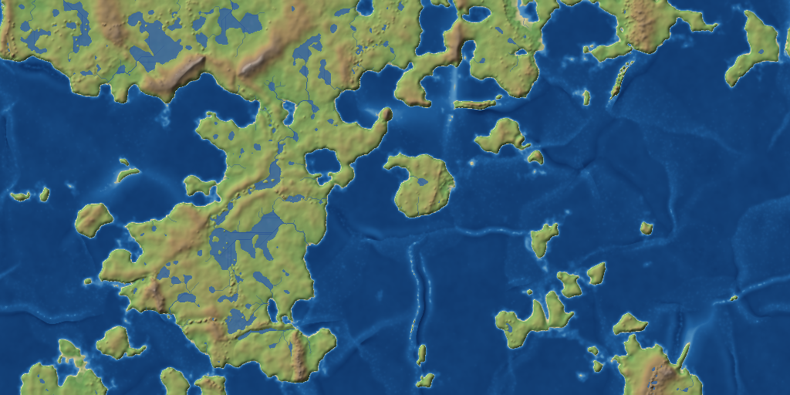
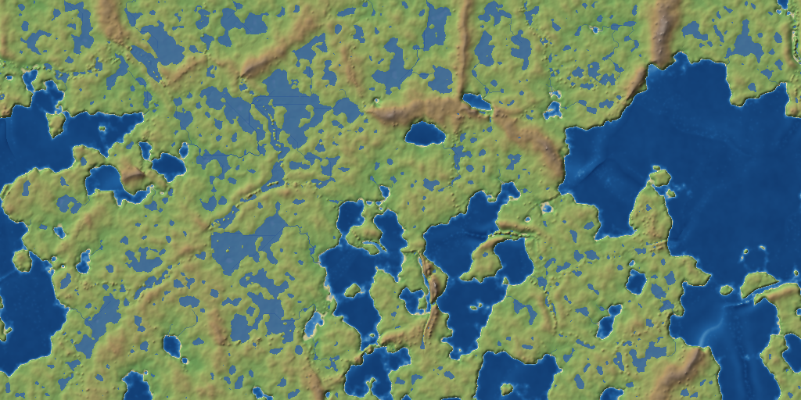
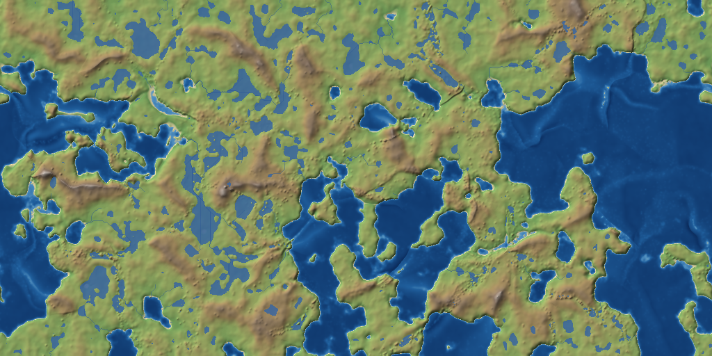
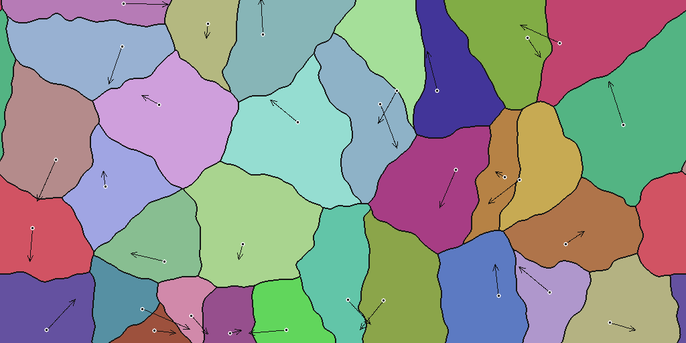
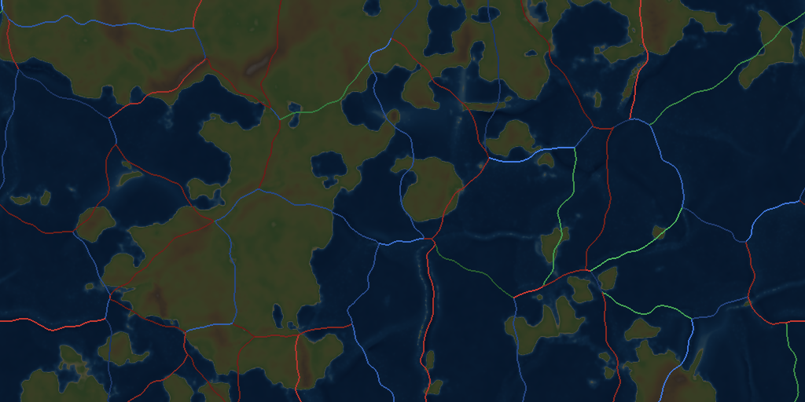
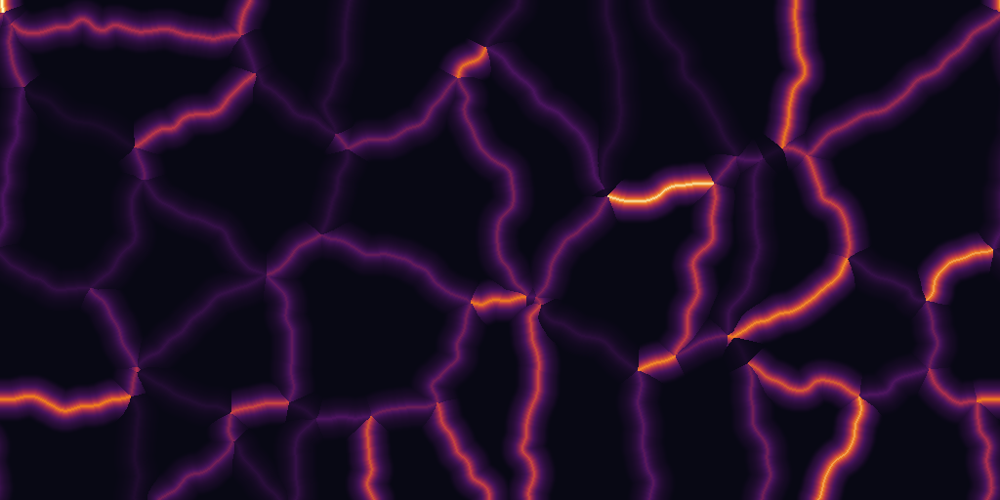
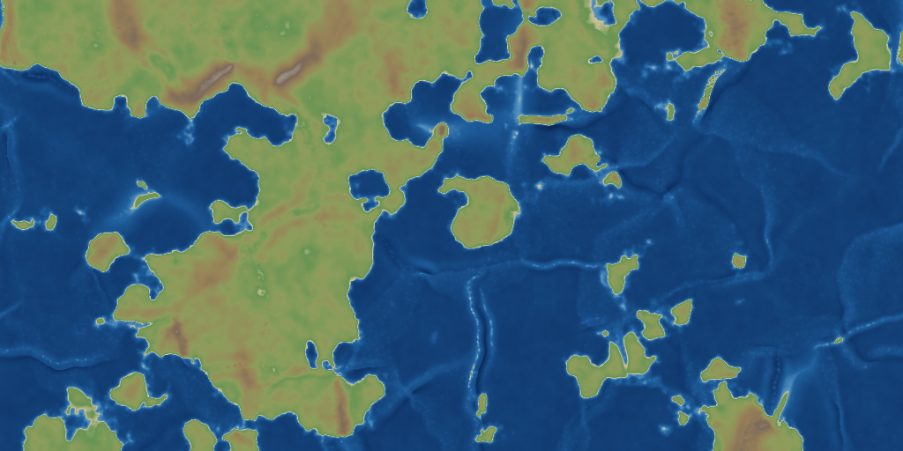
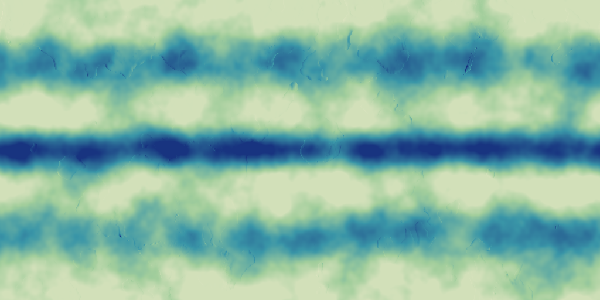
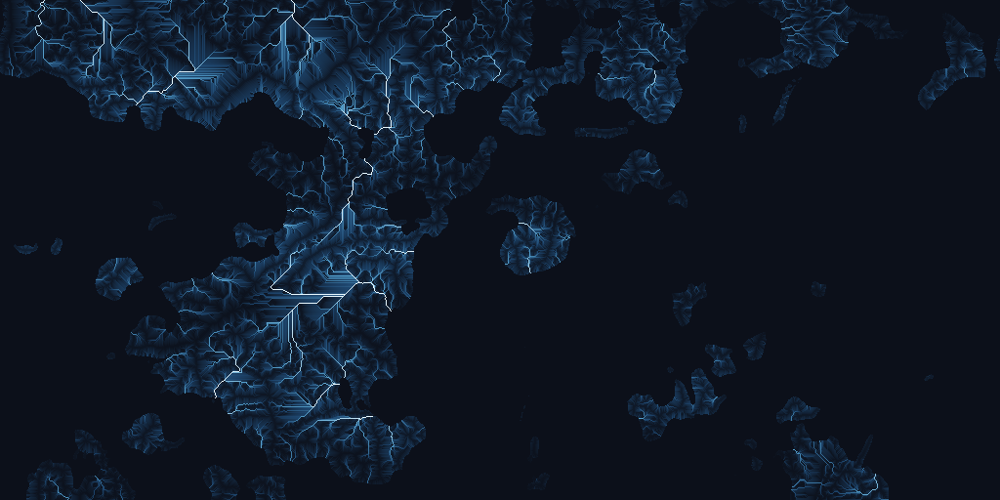

# voronoi-geology

A game-oriented plate tectonics world simulation, implementing
[`docs/plate-tectonics-world-sim-project-design.md`](docs/plate-tectonics-world-sim-project-design.md).

The world is a `1024 x 512` cylindrical heightfield: east/west wraps, north/south
are walls. Tectonic plates are moving Voronoi sites that drift across the fixed
grid. Boundary behaviour is derived from relative plate velocity, and every
effect is applied through a narrow distance falloff so features stay legible at
this resolution. Geology accumulates over hundreds of small steps rather than a
few large ones.



*Seed 42 after 400 steps. Mountain belts rim the western and southern edges of
the main continent, where plates are converging; rivers drain off them into
lakes and the sea.*

## Quick start

```sh
cargo run --release -- --seed 42 --steps 400 --layers all --out out
```

That writes every debug layer for the world pictured above.

```
--seed <N>           World seed (default clock milliseconds)
--steps <N>          Simulation iterations (default 240)
--plates <N>         Number of tectonic plates (default 32)
--continental <F>    Fraction of the world that is continental crust (default 0.4)
--width/--height     World size (default 1024 x 512)
--dt <F>             Geological time per iteration (default 1.0)
--sea-level <F>      Where the sea sits (default 0.0)
--erosion-every <N>  Run hydrology/erosion every N steps (default 2, 0 = off)
--layers <A,B,...>   Layers to write, or 'all'
--snapshot-every <N> Also write numbered snapshots, for watching the history
```

Roughly 57 ms/step at full resolution with 32 plates, so a 400-step world takes
about 25 seconds.

## How much land?

`--continental` is the dial. It sets what fraction of the world is continental
crust, and land fraction follows it almost linearly - about six points below it.
Measured at seed 42, 200 steps:

| `--continental` | land |
|---:|---:|
| 0.3 | 27% |
| 0.4 | 34% (default, roughly Earth) |
| 0.5 | 43% |
| 0.65 | 57% |
| 0.8 | 73% |

`--sea-level` also exists, but it is a trim rather than a dial: dropping it a
full 3 units only takes the default world from 34% to 46% land. The reason is
that hypsometry here is strongly bimodal - continents sit around +1 and ocean
floor around -4, with little terrain in between - so moving sea level through
that gap exposes continental shelf and not much else. Use it to nudge
coastlines, not to drain an ocean.

The two are not interchangeable, because `--continental` changes the geology and
`--sea-level` does not. Raise the continental fraction and most plates become
continental, so most convergent boundaries become continent/continent
collisions: broad mountain belts, and far fewer trenches, volcanic arcs and
island chains, since those all require an oceanic plate to subduct. Lower the sea
instead and the tectonics are untouched - you get the same arcs and trenches,
just with the water confined to the deepest basins.

### Recipe for a land-heavy world

```sh
cargo run --release -- --continental 0.75 --plates 56 --steps 400
```

The plate count matters as much as the land fraction here. A land-heavy world
has enormous continental interiors, and with only 32 plates those interiors sit
far from any boundary and stay flat - which, per section 10, is exactly what
the falloff is designed to guarantee. Raising the plate count puts more
boundaries through the continents, and the relief follows:

| | |
|---|---|
|  |  |
| `--continental 0.8` with 32 plates: flat interiors, lakes scattered at random | `--continental 0.75 --plates 56`: ridges across the interior, lakes collecting between them |

Expect lakes either way. A world with little ocean has few outlets for water to
reach, so drainage ends in inland basins - which is realistic, but it does lean
on the flat-routing weakness noted under the `flow` layer above.


## Layers

Every layer below is from one world - seed 42 after 400 steps - so they can be
read against each other. Regenerate them with:

```sh
cargo run --release -- --seed 42 --steps 400 --layers all --out out
```

Each layer isolates one stage. The point is that when a world looks wrong, the
question is *which stage* is wrong, and that is very hard to answer from the
finished terrain alone.

### `plates` - what is moving



Plate ownership, one colour per plate. Pale fills are continental plates,
saturated ones oceanic. The white dot is the plate's Voronoi site and the arrow
is its velocity, with length proportional to speed.

Read this first when a world looks wrong: if two neighbouring arrows point into
each other you should find a mountain belt between them, and if they point apart
you should find a rift. Note that the boundaries are visibly curved rather than
straight - that is the domain warp described below.

### `boundaries` - what the model decided



Classification over dimmed terrain: **red convergent**, **blue divergent**,
**green transform**. Brightness carries strength, so a fast boundary stands out
from a barely-moving one of the same kind.

This is the layer that answers "is the simulation deciding the right *kind* of
boundary here?". Compare it against `plates`: the classification should follow
the arrows. Compare it against `terrain`: red should coincide with mountains,
blue with rifts and ridges. Transform boundaries appear where the relative
motion runs along the boundary rather than across it, which is why they are
comparatively rare.

### `strength` - where deformation is going



Each boundary's strength carried through the same falloff the tectonics stage
uses. Bright means "this is being actively deformed".

This is the direct check on the design's central constraint (section 10): effects
must not spread into plate interiors. The interiors here are **black** - not
dim, but receiving nothing at all, because the falloff has a hard cutoff. If
this layer ever fills in, the radii are too wide for the plate size and the
world will turn to mush.

### `crust-age` - the geological memory


Young crust is bright, old crust is dark.

This comes out as a seafloor-spreading map without being written as one: crust
created at a divergent boundary starts at age zero, then ages as it moves away,
so every spreading centre sits inside a bright band that is symmetric about its
axis and darkens outward. Continental interiors are the oldest ground in the
world. It is also the layer that shows plate motion *history* rather than the
current instant, which makes it the best place to spot a plate that has been
drifting wrongly for a long time.

### `terrain` and `elevation` - the result



`elevation` is the raw heightfield under a hypsometric tint; `terrain` (at the
top of this README) adds hillshade, rivers and lakes. Having both matters
because hillshading is very good at hiding that terrain is actually flat, and
very good at inventing detail that is not in the data.

The pale halo around every coast is the continental shelf. The faint lines
crossing the deep ocean are mid-ocean ridges standing above the abyssal plain.

### `rainfall` - the climate input



Wet at the equator, dry through the subtropics, wet again along the mid-latitude
storm tracks, dry at the poles.

The latitude banding dominates at this scale; the orographic gain and rain
shadow are the faint texture visible over mountain belts rather than the strong
signal the bands are. If rivers are appearing where they should not, check here
first - flow accumulation can only route water that rainfall put down.

### `flow` - the drainage network



Flow accumulation on a log scale, with the sea masked out. Without the log, one
trunk river saturates and every tributary disappears.

Rivers are never drawn: this dendritic structure is what falls out of routing
rainfall downhill over the heightfield. Use it to validate river formation
before blaming the erosion stage for a bad-looking valley.

**A known artifact is visible here.** Some channels run dead straight, at 45
degrees or horizontally, across the flatter parts of the continent. That is D8
routing over flats that the depression fill levelled: the epsilon tilt gives
every cell somewhere to drain, but on a flat it points them all the same way, so
they form parallel straight channels instead of a branching network. It shows up
in the flow layer far more than in the finished terrain. Proper flat resolution
(Garbrecht and Martz) would fix it.


## Using it as a library

The CLI is a thin wrapper. The crate is meant to be embedded: generate a world
once, keep it in memory, and query it for the life of a game.

```toml
[dependencies]
voronoi-geology = { path = "../voronoi-geology" }
```

```rust
use voronoi_geology::simulation::{Simulation, SimulationParams};

let mut world = Simulation::new(SimulationParams {
    seed: 20_260_912,
    ..Default::default()
});
world.run(400);          // about 23 seconds at the default 1024x512
```

After `run`, nothing more needs to happen to it. `Simulation` is `Send + Sync`,
so it can be shared across threads behind an `Arc`.

### Asking about a place

```rust
let s = world.sample(512, 256);

s.elevation      // height relative to sea level; sea_level is 0.0
s.crust          // CrustType::Continental or ::Oceanic, from the owning plate
s.crust_age      // time since this crust formed; low near spreading centres
s.rainfall       // relative, not millimetres
s.flow           // upstream rainfall arriving here - a river, if large
s.lake_depth     // standing water above the terrain
s.sediment       // deposited over the world's history
s.latitude       // +90 at the north wall, -90 at the south
s.plate          // which plate holds this cell
s.plate_velocity // and where it is heading

s.is_land()      // elevation above sea level
s.altitude()     // height above sea level, 0 at sea
s.depth()        // depth below sea level, 0 on land
s.is_lake()

// The boundary currently shaping this cell, if it is near one at all.
// `None` means stable plate interior.
if let Some(b) = s.boundary {
    b.kind        // Convergent, Divergent or Transform
    b.distance    // in cells
    b.strength    // how hard it is working
    b.plates      // the two plates that meet here
}
```

`sample(x, y)` panics outside the world. For coordinates that might run off a
region, use `sample_at(x: i64, y: i64)`, which wraps x around the cylinder and
returns `None` past the northern and southern walls:

```rust
match world.sample_at(x, y) {
    Some(s) => ...,
    None => ...,   // off the top or bottom of the world
}
```

If your game's coordinates are finer than one cell, `elevation_at(x: f32, y: f32)`
interpolates. Only elevation is interpolated: crust type and plate id are
categorical, and blending rainfall or flow would invent water that is not there.

### Rivers

Flow accumulation is a continuous quantity, so "is this a river" needs a
threshold. `river_threshold()` derives one from the world's own distribution
rather than a fixed number, since total flow scales with world size and
rainfall:

```rust
let threshold = world.river_threshold();     // O(cells) - hoist it out of loops
for r in world.rivers(threshold) { ... }     // land cells at or above it
```

### Bulk access

`sample` is for asking about one place. Building a tile map, exporting a
heightmap or scanning for sites should read the flat arrays directly - they are
public, and iterating them is far faster than sampling cell by cell:

```rust
let sea = world.sea_level();
let land = world.world.elevation.iter().filter(|e| **e > sea).count();
```

`world.world` is the [`World`](src/world.rs): `elevation`, `rainfall`, `water`,
`flow`, `sediment`, `crust_age` and `plate_id`, each a flat `Vec` indexed by
`y * width + x` (use `world.world.idx(x, y)`). `world.plates`,
`world.boundaries` and `world.field` (the boundary distance field) are public
too.

A full worked example is in [`examples/rpg_world.rs`](examples/rpg_world.rs):

```sh
cargo run --release --example rpg_world
```

### Units and coordinates

- **Elevation** is not metres. Sea level is 0.0, ocean basins bottom out around
  -7 and the highest peaks reach about +8, so one unit is roughly a kilometre if
  you want a mental scale.
- **Rainfall and flow** are relative. Compare cells to each other rather than
  reading an absolute figure off them.
- **Crust age** is in units of simulation time: `steps x dt`.
- **x wraps, y does not.** East/west is a cylinder; north and south are walls.
  Any arithmetic on x needs `wrap_x`, and there is no cell beyond either wall.

### Memory and persistence

A finished 1024x512 world retains about 33 MB of field data. Peak usage while
stepping is roughly double that, for per-step scratch buffers that are freed
again; measured peak for a default world is around 70 MB. Both scale linearly
with cell count, so a 512x256 world is a quarter of it.

There is no serialisation yet. The world is fully determined by its
`SimulationParams` and step count, so the cheapest way to persist one is to
store the seed and parameters and regenerate - but that costs the full
generation time on load, so a game that cannot afford ~25 seconds at startup
will want to add serde to `World` and save the fields.


## Modules

| Module | Role | Design doc |
|---|---|---|
| `world` | The fixed grid and its cylindrical index rules | 2 |
| `plate` | Plates, the crust field, plate motion | 3, 4, 14 |
| `voronoi` | Ownership each step, plus the boundary warp | 5 |
| `boundary` | Detection, classification, distance field | 6-9 |
| `tectonics` | Deformation rules, falloff, volcanism | 7-14, 19-21 |
| `hydrology` | Rainfall, depression filling, flow routing | 17 |
| `erosion` | Incision, sediment transport, hillslope creep | 17 |
| `simulation` | The iteration order and the parameter set | 18 |
| `render` | Debug and terrain layers | 23 |
| `query` | Point queries for embedding in a game | - |
| `noise`, `math` | Seeded noise, cylinder math | - |

Everything is deterministic: the same seed always produces the same world.

## Decisions

The design doc (section 26) deliberately left a number of questions open. What
this implementation settled on, and why:

- **Plates at the walls reflect.** A site that would walk off the top or bottom
  bounces. Clamping would pile plates up against the wall; wrapping would
  contradict the cylinder.
- **Crust type comes from a noise field, not from plate ownership.** If crust
  type were read off the plate, every coastline would be a Voronoi edge and the
  world would look like polygon soup. A large-scale `CrustField` decides what is
  continent; plates take their type from the field under their site, and may
  straddle both kinds of crust.
- **Crust age lives on terrain cells.** Divergent boundaries reset it to zero and
  it grows everywhere else, so the crust-age layer reads as a spreading pattern.
  The per-plate mean is used for one decision: which of two oceanic plates
  subducts (the older, denser one).
- **Boundary effects use nearest-boundary attribution.** Each cell is affected by
  the single closest boundary, not the sum of every boundary in range. This is
  what keeps a mountain range traceable to one boundary.
- **Falloff is `exp(-d / 0.35r)`**, tapered over the last 30% of the radius and
  hard-zero beyond `r`, so the cutoff never shows up as a visible circular edge.
- **Sea level is fixed at 0.0** for the whole run.
- **Plate velocities are constant**, apart from wall reflection. Linear `vx/vy`
  only; no Euler poles.

### One addition beyond the design

Plate boundaries are **domain-warped** before the Voronoi lookup
(`voronoi::Warp`). Straight perpendicular bisectors produced dead-straight
mountain belts and left the polygon pattern visible through the finished world.
The warp is a fixed, precomputed distortion of the lookup position, so the
diagram stays deterministic and seamless while boundaries bend into something
that reads as a rift or a suture.

### Notes

- `CylinderNoise` maps x onto a circle in 3D so the noise is seamless across the
  x=0 seam by construction, rather than by a periodicity hack.
- Noise fields are **calibrated at construction** to a known standard deviation.
  Perlin fBm only spans about ±0.6 in practice, and by a factor that depends on
  the octave count, so without this an amplitude parameter would not mean what
  it says.
- The boundary distance field is an exact Euclidean distance transform
  (Felzenszwalb & Huttenlocher), O(cells), with the wrap handled by running the
  row pass over three tiled copies. A chamfer approximation was tried first and
  its ~5% error near the seam was too coarse for the falloffs to key off.
- Flow routing is priority-flood with an epsilon tilt, which fills every
  depression and yields a drainage direction for every cell in one pass. The
  order cells are popped in is a topological order of the network, so flow
  accumulation and sediment transport are single reverse sweeps.

## Tests

```sh
cargo test
```

85 tests. The interesting ones assert geological behaviour rather than
implementation details: that continental collision lifts both sides while
ocean/continent convergence digs a trench on one side and builds a cordillera on
the other, that a mid-ocean ridge stands above its flanks while a continental
rift sits below its shoulders, that effects never reach plate interiors, that
water is conserved through the drainage network, and that the same seed gives a
byte-identical world.
